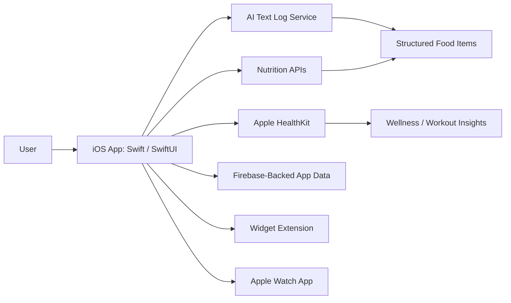

# MyFitPlate

## Overview

MyFitPlate is an iOS nutrition and fitness application built with Swift, SwiftUI, Apple Watch support, HealthKit integration, nutrition APIs, and AI-assisted logging workflows. The project focuses on reducing friction in food tracking and wellness monitoring by combining manual logging, barcode lookup, AI text-based meal parsing, workout tracking, and personalized insights.

The app includes a broad mobile feature set: calorie and macronutrient tracking, meal planning, grocery lists, recipes, water tracking, weight tracking, cycle tracking, workout routines, community features, watchOS views, widgets, and an AI assistant named Maia. The repository shows hands-on iOS development across UI, data models, API integrations, health data, and cross-device experiences.

From an engineering and security perspective, the project demonstrates mobile architecture, user-data handling considerations, API communication, authentication-oriented screens, and privacy-sensitive integrations such as HealthKit. It is not a cybersecurity lab, but it is relevant to application security and secure mobile development conversations because it handles health, nutrition, and user-generated data.

## Key Features

- Built an iOS app using Swift and SwiftUI.
- Added food logging, calorie tracking, macro tracking, and micronutrient views.
- Integrated barcode lookup and food search workflows.
- Added AI-assisted meal logging through structured JSON responses from an LLM.
- Integrated external nutrition data sources such as Open Food Facts and FatSecret-backed proxy workflows.
- Added HealthKit read/write workflows for nutrition, workouts, sleep, heart rate, HRV, and body weight data.
- Built workout routines, program creation, workout analytics, and workout report views.
- Added meal planning, recipe creation, grocery list, and meal suggestion features.
- Added water tracking, weight tracking, wellness scoring, cycle tracking, and journal features.
- Added Apple Watch and widget support for companion experiences.
- Built community and group-oriented features such as posts, comments, groups, and challenges.

## Architecture

The app is organized as a native iOS client with multiple SwiftUI feature modules. The mobile app communicates with nutrition APIs, an AI text logging service, HealthKit, Firebase-related configuration, and shared app/watch/widget data. Companion targets support Apple Watch and widget experiences.

## Tools & Technologies

### Mobile Development

- Swift
- SwiftUI
- Xcode
- UIKit interoperability
- WidgetKit
- watchOS app target

### Backend / Cloud / Data

- Firebase configuration
- Firestore-oriented service code
- External nutrition API services
- REST API calls

### AI and Data Processing

- OpenAI API integration for AI text meal logging
- JSON response parsing
- Nutrition estimate normalization
- Food and serving-size models

### Health / Device Integrations

- Apple HealthKit
- Apple Watch app
- Home screen widget
- Barcode scanning workflow

### Security and Privacy Considerations

- HealthKit permission prompts
- API key handling considerations
- User-generated health and nutrition data
- Secure network communication requirements

## Security and Engineering Concepts Demonstrated

This project demonstrates mobile application architecture, API integration, health-data permission handling, asynchronous networking, user-generated data workflows, and AI feature integration. Because the app handles nutrition, health, and wellness data, it also raises practical security and privacy considerations around data minimization, authentication, API key protection, and safe handling of sensitive user information.

The AI logging workflow is especially relevant to modern application security. User-provided meal descriptions are sent to an LLM and parsed into structured nutrition data, which means the application needs reliable response validation, error handling, privacy review, and safeguards around prompt and data handling.

## Implementation Steps

1. Built the main iOS app structure with SwiftUI views and navigation.
2. Added models for food items, servings, meals, workouts, reports, wellness scores, and user data.
3. Implemented manual food entry, food search, barcode scanning, and nutrition detail views.
4. Integrated nutrition APIs for food lookup and nutrient details.
5. Added AI text logging to convert meal descriptions into structured food entries.
6. Added HealthKit permissions and data workflows for nutrition, weight, workouts, sleep, heart rate, and HRV.
7. Built workout programs, routines, analytics, and reports.
8. Added meal planning, recipes, grocery list, and suggestions.
9. Added Apple Watch and widget targets for companion access.
10. Added community-oriented screens for posts, groups, challenges, and comments.

## Results / Findings

The repository shows a substantial native iOS application with many implemented screens, services, models, and integrations. It demonstrates practical mobile engineering across health data, nutrition APIs, AI-assisted parsing, companion device features, and user-facing wellness workflows.

The project also reveals areas that would make the app stronger for portfolio review: setup instructions, architecture documentation, explicit privacy notes, and clearer separation of secrets/configuration from source code. A security and privacy review has been added to document the app-security angle.

## Evidence / Artifacts

Text and code artifacts included in this repository:

- `CalorieBeta/`
- `CalorieWidget/`
- `MyFitPlateWatch Watch App/`
- `docs/security-privacy-review.md`
- `CalorieBeta/AITextLogService.swift`
- `CalorieBeta/HealthKitManager.swift`
- `CalorieBeta/OpenFoodFactsAPIService.swift`
- `CalorieBeta/FatSecretFoodAPIService.swift`

## Challenges & Lessons Learned

- Mobile health apps require careful permission handling and clear user trust signals.
- AI-generated nutrition estimates need validation and graceful error handling because model output can vary.
- Nutrition APIs return inconsistent serving and micronutrient data, so parsing and normalization matter.
- Cross-device support requires shared state planning between iOS, watchOS, and widgets.
- A large feature set benefits from clear architecture documentation and modular organization.

## Relevance to Security and Engineering Roles

This project is most relevant to iOS Developer, Mobile Engineer, Full-Stack Mobile Developer, and AI Application Developer roles. It also supports Application Security conversations because it involves user authentication screens, API communication, HealthKit permissions, user-generated health data, and AI-assisted data processing.

For security-focused roles, the strongest angle is secure mobile development: protecting API keys, limiting sensitive data exposure, validating LLM responses, handling health permissions responsibly, and documenting privacy/security decisions.

## Future Improvements

- Add setup instructions for Xcode, Firebase, HealthKit, and required API keys.
- Move secrets and environment-specific values out of source files.
- Add tests for API parsing and AI response validation.
- Add architecture documentation for app modules and data flow.
- Add a short demo video or GIF for the core food logging workflow if the app is being actively showcased.
- Add App Store / TestFlight status if applicable.
