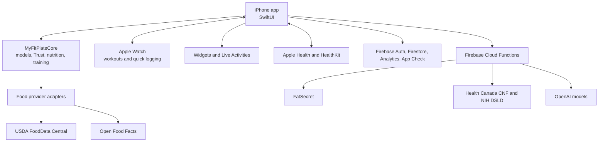

<div align="center">
  
  <h1>MyFitPlate</h1>
  <p><strong>The food log you can trust, built for people who train.</strong></p>
  <p>Nutrition, training, recovery, and an evidence-aware AI coach in one native Apple experience.</p>
  <p>
    <a href="https://apps.apple.com/us/app/myfitplate/id6740922831"></a>
    
    <a href="https://github.com/PeteAndrews1289/MyFitPlate/actions/workflows/ci.yml"></a>
  </p>
</div>

## What MyFitPlate Is

MyFitPlate is a native iPhone and Apple Watch app that connects food logging with the training and
recovery decisions people make every day. Logging is designed to be fast, but not opaque: when a
food record, estimate, or coaching suggestion affects the user's totals, the app should explain
where it came from and how much confidence to place in it.

The current App Store release is **2.2**. It combines a full nutrition diary with barcode and camera
logging, the Maia AI coach, strength and running tools, Apple Health integration, meal planning,
grocery and restaurant workflows, reports, widgets, Live Activities, and an Apple Watch companion.

[View MyFitPlate on the App Store](https://apps.apple.com/us/app/myfitplate/id6740922831)

## The Difference: Food Trust

Nutrition databases often disagree, omit nutrients, use incompatible serving sizes, or repeat the
same manufacturer label through several providers. MyFitPlate treats that as a product problem
rather than hiding it behind a single green checkmark.

The Food Passport and Trust Score surface:

- the provider and evidence lineage behind a food;
- barcode identity and serving-size evidence;
- cross-database agreement when records are actually comparable;
- nutrition sanity checks and values that need correction;
- a direct correction path for saved and scanned foods;
- clear separation between source-reported data, agreement, and stronger analytical evidence.

The goal is not to claim certainty that the data cannot support. The goal is to help users log
quickly, see limitations, and repair questionable entries before those entries shape their day.

## Product Areas

### Food and nutrition

- Manual entry, recent and saved foods, meal reuse, and recipe logging
- Text, barcode, multi-barcode, nutrition-label, receipt, menu, pantry, and meal-photo workflows
- Calories, macros, fiber, sodium, and detailed micronutrients
- Food search across USDA FoodData Central, FatSecret, and Open Food Facts
- Food Trust review, source evidence, corrections, and personal food history

### Training and recovery

- Strength programs, routines, supersets, RPE/RIR, set types, rest timers, and progression guidance
- Outdoor running with route, pace, splits, heart-rate zones, training fuel, and shoe mileage
- Apple Watch workout capture and phone-to-watch synchronization
- Apple Health context for workouts, heart rate, sleep, HRV, weight, and nutrition
- Workout history, muscle-group analytics, wellness signals, and recovery guidance

### Planning and coaching

- Maia, an AI coach for questions, meal ideas, and reviewable logging actions
- Seven-day meal plans, recipes, pantry tools, and generated grocery lists
- Restaurant menu analysis, fast-food building, and buffet planning
- Adaptive calorie and macro goals, hydration, fasting, body trends, and weekly reports
- Widgets and Live Activities for useful information outside the main app

## Version 2.3 In Development

Version 2.3 is the active development line. Its work is organized around one product language:
**signal, evidence, action**.

- A unified visual system across nutrition, training, planning, Maia, reports, and settings
- Living Day, a source-aware timeline that connects food, training, hydration, and recovery
- Recovery Field, an interactive muscle view with explicit inputs and limitations
- Trust 3.0, with deeper nutrient provenance, calibration, and correction feedback
- Specialist Health Canada food composition and NIH supplement-label coverage
- Purpose-routed camera logging with database grounding and an explicit estimate review step
- Broader accessibility, visual-regression, device, Watch, and release acceptance coverage

These items describe active development, not promises in the currently published 2.2 binary.

## Release And Branch Policy

| Ref | Role |
| --- | --- |
| `main` | Production baseline. The exact App Store 2.2 source is tagged `v2.2`. |
| `codex/2.3-visual-unification` | The only active development branch for version 2.3. |

Short-lived pull-request branches may be used for isolated release work, then deleted after merge.
Unreleased 2.3 code does not move to `main` until its acceptance checks are complete.

## Architecture


```mermaid
flowchart TB
    App["iPhone app\nSwiftUI"] --> Core["MyFitPlateCore\nmodels, Trust, nutrition, training"]
    App <--> Watch["Apple Watch\nworkouts and quick logging"]
    App --> Extensions["Widgets and Live Activities"]
    App <--> Health["Apple Health and HealthKit"]
    App --> Firebase["Firebase Auth, Firestore, Analytics, App Check"]
    Core --> Food["Food provider adapters"]
    Food --> USDA["USDA FoodData Central"]
    Food --> OFF["Open Food Facts"]
    App --> Functions["Firebase Cloud Functions"]
    Functions --> FatSecret["FatSecret"]
    Functions --> Reference["Health Canada CNF and NIH DSLD"]
    Functions --> OpenAI["OpenAI models"]
```

The iOS app owns presentation and device integrations. Reusable models, validation, ranking,
Trust, and deterministic planning logic live in `MyFitPlateCore`. Cloud Functions protect AI and
provider credentials, enforce quotas, validate structured responses, and handle privileged data
operations. Firestore rules, App Check, and server-owned deletion protect the shared data layer.

## Repository Map

| Path | Purpose |
| --- | --- |
| `CalorieBeta/` | Main iOS app, feature screens, infrastructure, resources, and design system |
| `MyFitPlateCore/` | Reusable Swift package and deterministic unit-test suite |
| `MyFitPlateWatch Watch App/` | watchOS companion and workout experience |
| `CalorieWidget/` | Home and Lock Screen widgets |
| `LiveActivity/` | Workout and timer Live Activities |
| `functions/` | TypeScript Firebase Cloud Functions and backend tests |
| `MyFitPlateTests/` | App-level unit and rendering tests |
| `MyFitPlateUITests/` | End-to-end UI smoke and reachability tests |
| `docs/` | Product contracts, release acceptance, privacy, Trust, and operations notes |
| `scripts/` and `tools/` | CI checks, data builders, migrations, and release tooling |

## Local Development

### Requirements

- macOS with a current stable Xcode release
- An iOS 17 or newer simulator or physical device
- Node.js 22 for Firebase Functions
- Java 21 when running Firestore emulator tests
- SwiftLint for the same lint checks used by CI

### App setup

```bash
git clone https://github.com/PeteAndrews1289/MyFitPlate.git
cd MyFitPlate
cp secrets.example.xcconfig secrets.xcconfig
open MyFitPlate.xcodeproj
```

Fill `secrets.xcconfig` only with values for an environment you control. The file is ignored by
Git. A complete signed build also needs an Apple development team, matching entitlements, a
Firebase project configuration, and deployed backend functions. OpenAI credentials belong in
Cloud Functions secret storage, not in the app bundle.

Select the `MyFitPlate` scheme and let Xcode resolve Swift Package Manager dependencies. A fork
should use its own Firebase project and must not treat the production backend as development
infrastructure.

### Core and backend checks

```bash
swift test --package-path MyFitPlateCore

cd functions
npm ci
npm test
```

The GitHub Actions pipeline also runs strict SwiftLint, visual-system enforcement, app unit tests,
UI smoke tests, release compilation, Firestore rule tests, coverage floors, dependency audit, and
migration-runner tests.

## Product And Safety Contracts

- [Design system](DESIGN.md)
- [Roadmap](ROADMAP.md)
- [Trust Score model](docs/trust-score-model.md)
- [Security and privacy review](docs/security-privacy-review.md)
- [Privacy Policy](docs/privacy_policy.md)
- [Terms of Service](docs/terms_of_service.md)
- [Support](docs/support.md)

MyFitPlate is a wellness and fitness product, not a medical device. Its estimates and coaching do
not diagnose conditions or replace advice from a qualified healthcare professional.

## Feedback

Product feedback and reproducible bug reports are welcome through
[GitHub Issues](https://github.com/PeteAndrews1289/MyFitPlate/issues). Account, privacy, billing, or
data requests should use the contact path in [Support](docs/support.md).

## License

This repository is published for product transparency and portfolio review. No open-source license
is granted. All source code, visual assets, product copy, and trademarks are copyright MyFitPlate;
all rights reserved. Third-party data and services remain subject to their respective terms and
licenses.
